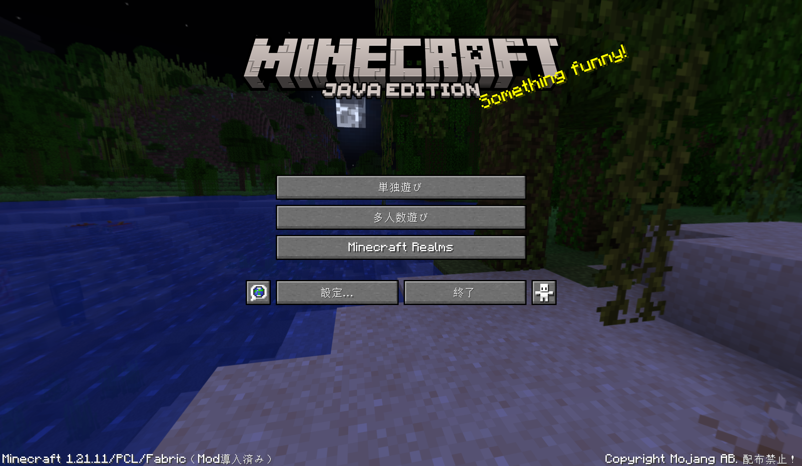
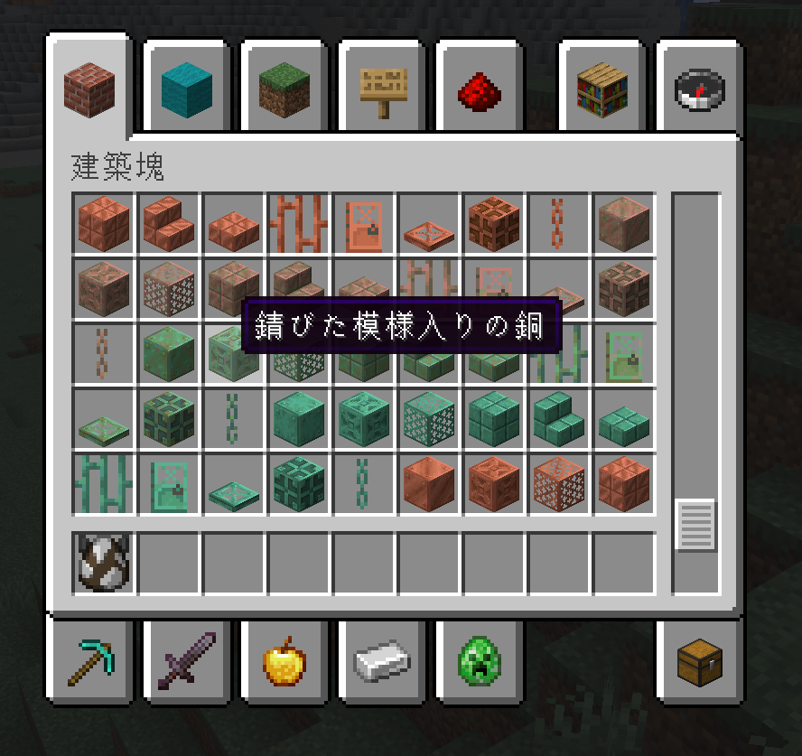
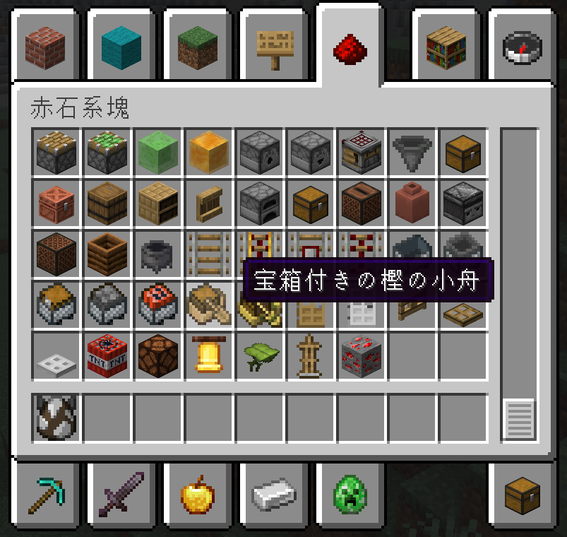
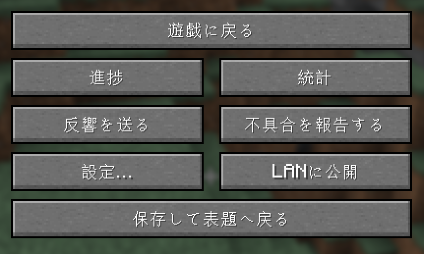

# Minecraft汉字化日本语 / Minecraft Kanji Japanese Pack / マインクラフト漢字化日本語

  

  
  
  
  

> [!NOTE]
> 非官方粉丝项目 · Unofficial fan project · 非公式ファンメイド作品

> [!WARNING]
> 请勿将本资源包用于商业用途 · Do not use this pack commercially · 商用利用は禁止です

---

## 截图预览

| 截图 1 | 截图 2 |
|---|---|
|  |  |

| 截图 3 | 截图 4 |
|---|---|
|  |  |

---

## 目录

- [中文](#中文)
- [English](#english)
- [日本語](#日本語)
- [许可证](#许可证)
- [贡献](#贡献)

---

## 中文

### 简介

这是一个面向 Minecraft Java 版的非官方日语翻译资源包，目标是在日语翻译中优先使用汉字词和和语，减少片假名。

- 非官方项目，与 Mojang / Microsoft 无关，也不是官方翻译。
- Minecraft 是 Mojang Studios / Microsoft 的商标。

### 支持版本

- Minecraft Java Edition 1.13 及以上（`pack_format=4`）
- 以 26.2 为主要翻译对齐版本

### 包含内容

- `assets/minecraft/lang/ja_jp.json`：全部游戏语言键（8,259 条）
- `assets/minecraft/texts/end.txt`：终末之诗（近代文语体翻译）
- `assets/minecraft/texts/credits.json`：制作人员名单
- `assets/minecraft/texts/postcredits.txt`：结尾引用
- `assets/minecraft/texts/splashes.txt`：标题画面标语（按要求保持原文）

### 翻译方针

1. 优先使用现代日语汉字词
2. 其次使用和语（大和言葉）
3. 再次使用近代日语、文语表达
4. 古代日语作为最后手段
5. 确实没有合适日语时才保留片假名

### 安装方法

1. 下载 Releases 中的资源包 zip（例如 `日语汉字化资源包_v26.2.zip`）
2. 将 zip 文件**直接**放入 `.minecraft/resourcepacks/`，不需要解压
3. 游戏内：设置 → 资源包 → 启用
4. 将游戏语言设置为「日本語」

---

## English

### Overview

This is an unofficial Japanese translation resource pack for Minecraft Java Edition. The goal is to prioritize kanji compounds and native Japanese (wago) over katakana loanwords.

- Unofficial fan project. Not affiliated with Mojang / Microsoft, and not an official translation.
- Minecraft is a trademark of Mojang Studios / Microsoft.

### Supported Versions

- Minecraft Java Edition 1.13+ (`pack_format=4`)
- Primarily aligned with version 26.2

### Contents

- `assets/minecraft/lang/ja_jp.json`: all game language keys (8,259 entries)
- `assets/minecraft/texts/end.txt`: the End Poem (translated in a modern literary Japanese style)
- `assets/minecraft/texts/credits.json`: credits
- `assets/minecraft/texts/postcredits.txt`: post-credits quote
- `assets/minecraft/texts/splashes.txt`: title-screen splashes (kept as the original, as requested)

### Translation Policy

1. Prefer modern Japanese kanji words.
2. Otherwise prefer native Japanese (wago).
3. Otherwise use modern literary/classical-flavored Japanese.
4. Use archaic Japanese only as a last resort.
5. Keep katakana only when no suitable Japanese equivalent exists.

### Installation

1. Download the resource pack zip from Releases (e.g. `日语汉字化资源包_v26.2.zip`).
2. Put the zip **directly** into `.minecraft/resourcepacks/` — no need to extract it.
3. In game: Options → Resource Packs → enable it.
4. Set the game language to 日本語.

---

## 日本語

### 概要

Minecraft Java Edition 向けの非公式日本語翻訳リソースパックです。カタカナ語を減らし、漢字語・和語を優先することを目指しています。

- 非公式ファンメイド作品です。Mojang / Microsoft とは関係なく、公式翻訳でもありません。
- Minecraft は Mojang Studios / Microsoft の商標です。

### 対応バージョン

- Minecraft Java Edition 1.13 以降（`pack_format=4`）
- 26.2 を主対象に翻訳済み

### 内容

- `assets/minecraft/lang/ja_jp.json`：ゲーム内の全言語キー（8,259 件）
- `assets/minecraft/texts/end.txt`：終末の詩（近代文語体訳）
- `assets/minecraft/texts/credits.json`：スタッフロール
- `assets/minecraft/texts/postcredits.txt`：エンドロール後メッセージ
- `assets/minecraft/texts/splashes.txt`：タイトル画面のスプラッシュ文字（原文のまま）

### 翻訳方針

1. 現代日本語の漢字語を最優先
2. 次に和語（大和言葉）
3. 近代日本語・文語表現
4. 古代日本語は最後の手段
5. どうしても適切な日本語がない場合のみ片仮名を残す

### 導入方法

1. Releases からリソースパック zip（例：`日语汉字化资源包_v26.2.zip`）をダウンロード
2. zip を**そのまま** `.minecraft/resourcepacks/` に入れる（解凍は不要）
3. ゲーム内で「設定 → リソースパック」から有効化
4. ゲーム内言語を「日本語」に設定

---

## 翻译示例

| 官方日语 | 本包 | 读法 | 说明 |
|---|---|---|---|
| ゾンビ | 屍 | しかばね | 汉字优先 |
| クリーパー | 這い寄る者 | はいよるもの | 和语/文语 |
| エンダードラゴン | 果ての竜 | はてのりゅう | 汉字词 |
| ダイヤモンド | 金剛石 | こんごうせき | 汉字词 |
| エンチャント | 付呪 | ふじゅ | 汉字词 |
| ワールド | 世界 | せかい | 汉字词 |
| プレイヤー | 遊び手 | あそびて | 和语 |
| ネザライト | 奈落金 | ならくきん | 创作汉字词 |

---

## 兼容性

- 资源包使用 `pack_format=4`，这是 1.13 时代的格式，用于最大化兼容 1.13+ 的旧版本。
- 在很新的版本（包括 26.2）中可能会提示“这个资源包是为旧版本制作的”，一般仍可正常加载。
- 如果某个版本拒绝加载，请在 Issues 中反馈，我会更新 `pack_format`。

---

## 许可证

### 中文

- 翻译文本与资源包内容：**CC BY-NC-SA 4.0**
- 禁止商用；修改再发布时须使用相同许可证并署名。

### English

- Translation text and resource pack contents: **CC BY-NC-SA 4.0**
- NonCommercial only. Remixes must be shared under the same license with attribution.

### 日本語

- 翻訳テキスト・リソースパック内容：**CC BY-NC-SA 4.0**
- 商用利用不可。改変時は同じライセンスで公開し、出典を明記してください。

---

## 贡献

### 中文

如果你觉得某句翻译不自然，欢迎开 Issue 或 PR。

### English

If you find any translation unnatural, feel free to open an Issue or PR.

### 日本語

不自然な訳を見つけたら、ぜひ Issue や PR を開いてください。
